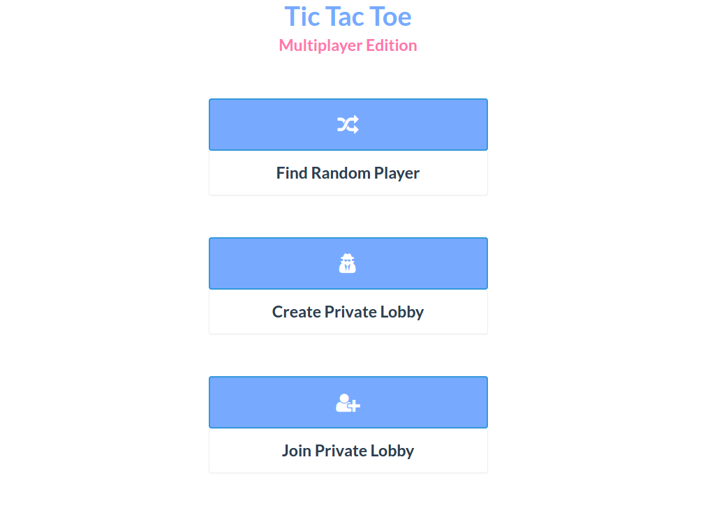
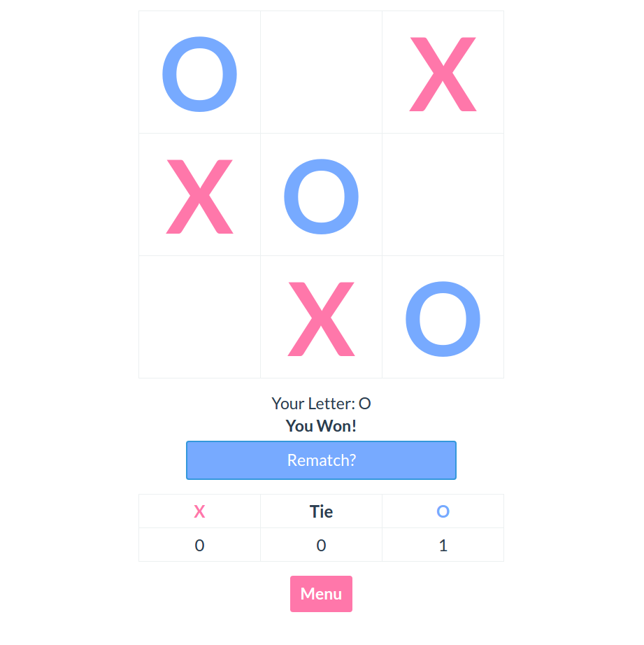

# Tic Tac Toe: Multiplayer Edition

I made this because I just learned what sockets in Node.JS were and I wanted to make 
a game using them. 


From the main menu you can search for a random game or create a private lobby.


This is what the tic tac toe board looks like in action.

To run the project, go to the main directory and run the command below.
```
node server.js
```
Then go to [localhost:4000](http://localhost:4000) to view the project.

<br>

The default port it is run at is 4000, but you can change it in the server.js file.


